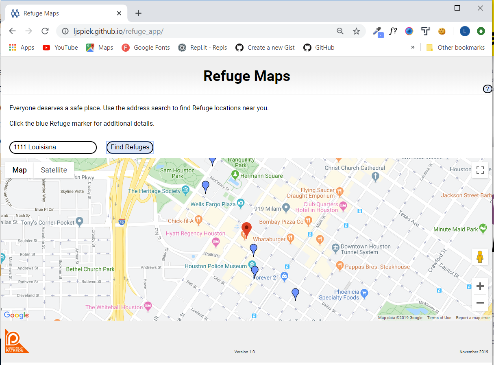
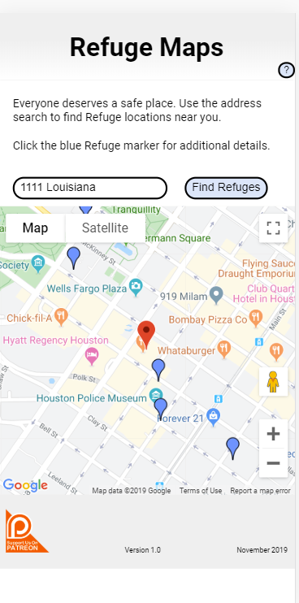

<h1>Refuge Map App</h1>

Refuges are safe restrooms for transgender, intersex, and gender nonconforming individuals.

<h2>Version 1.0 Features:</h2>

<ul>
    <li>This app allows users to search by address</li>
    <li>Upon clicking 'Find Refuges' the address entered will be pinned along with the nearest Refuges</li>
    <li>Invalid address entries will produce an error message</li>
    <li>If no Refuges are found, users will receive a warning message asking them to search for another address</li>

</ul>

<h2>Technologies Used:</h2>

<ul>
    <li>HTML5</li>
    <li>CSS</li>
    <li>JavaScript</li>
    <li>jQuery</li>
    <li>API connections: Google Maps API and Refuge API</li>
</ul>

<h2><a href="https://ljspiek.github.io/refuge_app/" target=blank>Click to view the live app</a>

<h2>Screenshots</h2>

<h4>Desktop:</h4>

<h4>Mobile:</h4>

<h3>Support Refuges!<h3>

